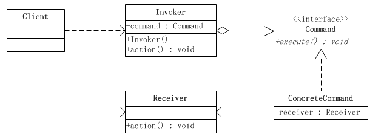

# 命令模式

### 定义： 
将请求封装成对象，以便使不同的请求，队列或者日志来参数化其他对象
命令模式也支持可撤销的操作

主要有4个角色
遥控器举例 
+ client(请求发出者): 人,用于把各个角色串联起来
+ invoker(请求调用者) :遥控器,通过信号传递`遥控器就不需要长在电视里了`
+ receiver(请求接受者): 电视,对遥控器指令的实现
+ command(请求或命令): 信号,封装好的请求

invoker 和 receiver通过command解耦了

### 类图:

### 撤销命令
原理---由于所有命令都通过invoker来执行
（setCommand---**指定命令的接收对象**）
因此命令的引用被统一了，只需要在invoker中加入某些变量就能记录
上一条执行的命令，拿着这个引用就能回到之前的状态
+ 进阶---变量不仅仅记录一个引用，以堆栈记录就能实现一直撤销的操作
### 命令宏
一次执行多条命令，原理同上，只不过需要准备一个宏命令（Command子类）---这个命令拥有这一组命令的引用
将这个宏命令交给invoker----宏命令的execute中调用其他命令的execute

### 队列请求

### 日志请求