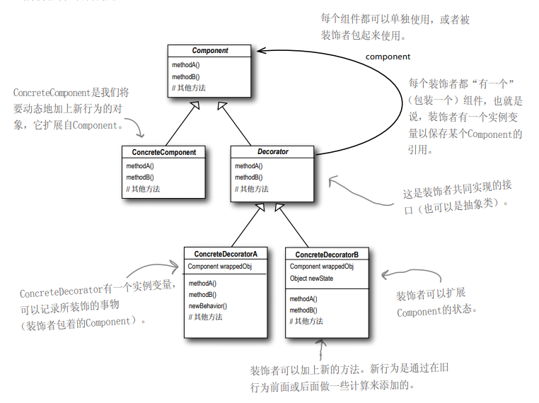
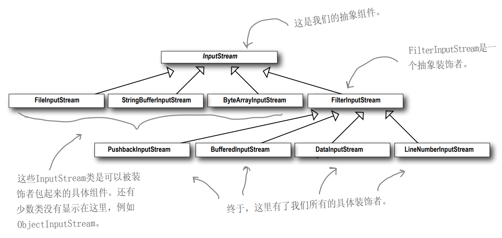

# DECORATOR

 **定义**
 
  
装饰者模式动态地将责任附加到对象上。
若要扩展功能，装饰者提供了比继承更有弹性
的替代方案。

指导思想：
+ 类应该对扩展开放，对修改关闭。

类图：

Component是一个大类,抽象程度较高,比如饮料(原味咖啡,拿铁,咖啡配料以及咖啡装饰器都是其子类)
Decorator中含有Component的一个引用,因为同级的类,原味,拿铁需要增强其功能,但又不能针对具体某个类,
所以使用其父类作为引用
ConcreteDecorator是增强方法的执行者,Decorator将装饰的请求委托到这里执行,
此时的执行对象跟原对象已经很不一样了

+ 使用装饰器模式会改变对象的类型，
如果针对抽象组件编程就不会受到装饰器影响
如果确定要针对具体类型进行编程，那么就要思考整个架构，
以及是否能接受装饰器的影响
 
 

+ 装饰器嵌套太多，需要有一个管理机制来管理这些装饰器，
故经常搭配工厂或生成器来封装创建过程
 
+ 装饰器在一系列嵌套中是独立的，不需要知道别的装饰器的存在
但要去知晓其他的装饰器并不是没有办法 ,用一个ArrayList

--------
IO流中对装饰器模式的应用，基本的流就那几个，其他的装饰器只是增强功能而已

