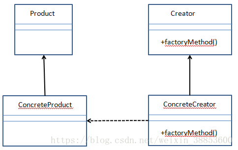

#工厂模式

常见有3种工厂的模型
+ 简单工厂: 允许接口创建对象，但不会暴露对象的创建逻辑。
+ 工厂方法:  允许接口创建对象，但使用哪个类来创建对象，则是交由子类决定的。
+ 抽象工厂: 抽象工厂是一个能够创建一系列相关的对象而无需指定/公开其具体类的接口。
该模式能够提供其他工厂的对象，
在其内部创建其他对象。

### 定义:

+ 简单工厂: 客户端通过工厂提供的方法,参数来实例化对象,而不是直接实例化对象

+ 工厂方法: 定义了一个创建对象的接口,
但由子类决定要实例化的类是哪一个,
工厂方法让类的实例化推迟到子类

工厂方法其实就是一个抽象方法,子类覆写后根据实际情况创建对象实例

+ 

### 类图:

+ 简单工厂:

+ 工厂方法:

+ 

### 优缺点:

工厂方法:
+ 它们是松耦合的，因为创建对象的代码与使用它的代码是分开的。
客户端完全不需要关心要传递哪些参数以及需要实例化哪些类。
由于添加新类更加容易，
所以降低了维护成本。

+ 它具有更大的灵活性，使得代码更加通用，
因为它不是单纯地实例化某个类。
这样，实现哪些类取决于接口（Product），
而不是ConcreteCreator。