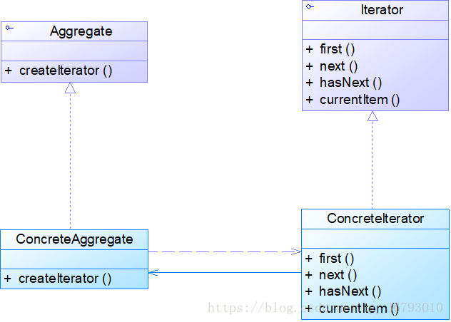
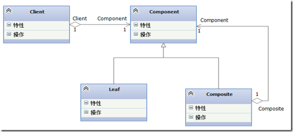

# 迭代和组合

## 迭代
### 定义:

迭代: 提供一种方法顺序访问一个聚合对象中的各个元素,而又不暴露其内部的实现

我们需要对聚合对象进行遍历(它是抽象的超类),有可能有多重遍历的形式(不同子类不同的实现),
或者我们知识需要遍历它,对于用户来说是无所谓的,引入一个迭代器(Iterator),提供了统一的遍历方式,
其每个子类在根据聚合对象实际遍历进行整合

迭代有两种,内部迭代和外部迭代
内部迭代是由对象(方法)本身去维护上下链接的关系
外部迭代需要借助其他的数据结构来记录调用关系
用组合模式中的例子来说print1()是内部迭代,print()是外部迭代
print1自身维护了递归的关系,print则是借助了栈的存储

优点:
+ 用户只通过Iterator来遍历,具体实现被隐藏了
+ 遍历与实现的分来的(解耦)遍历只通过hasNext和next
+ 复用性好,

### 类图:

----------------------
## 组合模式

### 定义:

允许你将对象组合成树形结构来表现"整体/部分"层次结构.
组合能让客户以一致的方式处理个别对象以及对象组合

说白了就是个树形结构,而且忽略了对象和对象组合的差别
菜单和目录,文件和文件夹

组合模式很好的维护了操作的透明性,通过让组件的接口同时包含子节点和叶子节点的相关操作,
用户就能一视同仁,具体是叶子还是子节点对用户是透明的

这样做会是的丢失一些安全性,比如叶子节点再添加子节点(这不是一种数据结构),
这是由于责任混合的原因,违反了单一责任原则,但具体要怎么设计需要考虑具体环境

### 类图:

组合模式很好的维护了