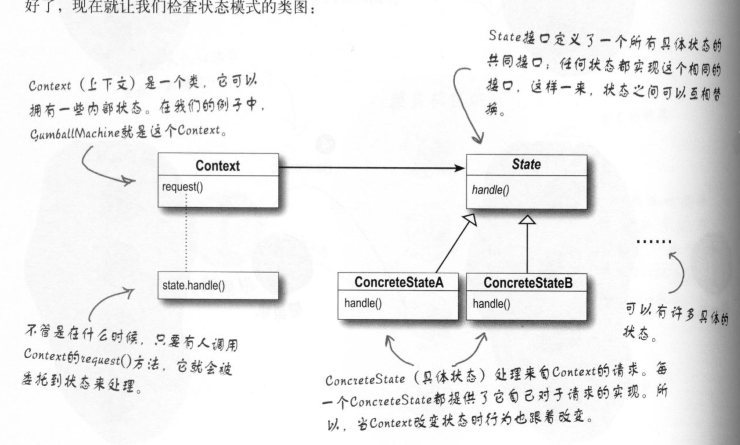

# 状态模式

1. 定义: 
```状态模式``` 允许对象在内部状态改变时,
改变它的行为,对象看起来好像修改了它的类
一个类中,内部封装了多种状态,
但某一时刻只处于其中一种装态,
这个状态可以改变(转换),
这些状态都有共同特点(实现统一接口,复写接口方法),
故对象的行为将会不同(客户看来),就如同改变了类

2. 类图: 
 <br>
 
3. 优缺点:<br>
    + 优点: 
        + 封装了转换规则.
        + 将所有与某个状态有关的行为放到一个类中，
        并且可以方便地增加新的状态，
        只需要改变对象状态即可改变对象的行为。 
        + 允许状态转换逻辑与状态对象合成一体，
        而不是某一个巨大的条件语句块
        + 可以让多个环境对象共享一个状态对象，
        从而减少系统中对象的个数。
    + 缺点: 
        +  状态模式的使用必然会增加系统类和对象的个数。 
        + 状态模式的结构与实现都较为复杂，
        如果使用不当将导致程序结构和代码的混乱。
        + 状态模式对“开闭原则”的支持并不太好，
        对于可以切换状态的状态模式，
        增加新的状态类需要修改那些负责状态转换的源代码，
        否则无法切换到新增状态；
        而且修改某个状态类的行为也需修改对应类的源代码。
    <br>
4. 对比策略模式:
```
两者类图相同,但是两种模式的对类的操作意图不同,
策略模式:客户指定一种策略,即context可以感知具体的实现类是什么
状态模式:Context不感知State的具体实现
```