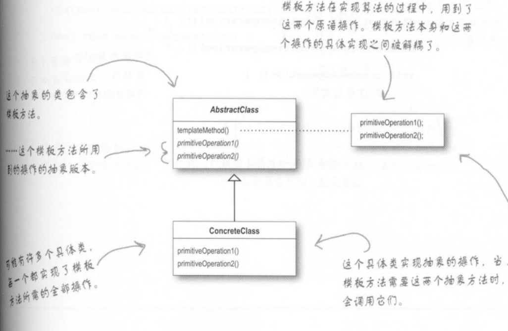
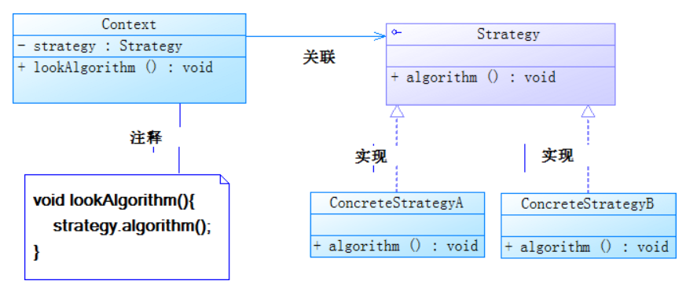

# 模板方法 和 策略
### 两种比较
先说结果：
+ 模板给定规则的大纲，是一条线，而我们能做的事是在少部分点上做一些拓展
。我们（子类）做的东西限制性大
+ 策略将一些操作抽象成了组件，组件也是抽象的，我们可以定制具体的组件实现类
然后为策略执行**做准备**，行为都是定制的所以自由度更高 
前者继承，后者组合
当然以上都是为了区分而区分，实际应用中适合什么用什么 

--------------
### 模板方法

定义：
+ 定义一个操作的算法（运行步骤）骨架，但是将一些步骤交给子类进行书写
templateMethod是的子类在不改变算法结构的同时，又可以重新定义算法的特定
步骤

+ 多个相同操作，仅有部分又差别，抽象出个父类，共同的部分写死，差异的部分交给子类完成，
但整个的框架仍是由父类确定，子类能做的只是在一个完整框架中填空。

### 类图

### 效果
1. 抽取公共行为
2. 反向控制---》**钩子**函数---》**_好莱坞原则_**``别来找我，我来找你`
 + 具体操作：
    在模板方法templateMethod()中视情况调用一个钩子函数（默认为空操作）
   钩子可以被子类重写，添加扩展 

## 策略模式

### 定义
+ 定义一系列算法，把他们一个个封装起来，并且可以相互替换，使用哪个决定在客户端
+ 依旧是一些操作步骤`方法的运行`定义在公共类里面，这些操作被封装成几个类，
即：公共类是由这些操作封装成的类**组成**。现在客户端想要什么功能，可以实现不同的操作（继承操作的父类）
，故操作是由客户端决定的。

### 类图
